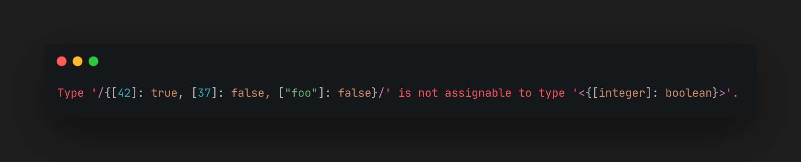

# Tau

> Type-checking the everlasting flame at v0.1.1

Tau (τ) is a runtime type-validation library for [GraalVM Polyglot](https://www.graalvm.org/latest/reference-manual/polyglot-programming/) values. It
was primarily designed for [Fuse](https://github.com/fusemc-dev)'s needs of seamless type-safe integration with JavaScript. Despite its
origins, Tau is a _general-purpose_ library and doesn't rely on Fuse in any way.

## Getting Started

> You'll surely find the artifacts to depend on here once Tau leaves its beta stage.

## Templates

> [!NOTE]
> Throughout this section, the `/.../` circumfix syntax is used to denote `Value` literals. `/42/` thus defines a `Value` of `42`. You will shortly discover that
> the `/.../` syntax isn't used coincidentally.

Type validation in Tau is done through [Template](https://fusemc.dev/tau/blob/master/src/main/java/dev/fusemc/tau/Template.java)s. A template may be thought of
as a _reusable_, _**bidirectional**_ type-schema, that is capable of _describing_ itself.

A `Template` functions as a type-safe mapping from a `Value` to some type `T`, and **vice versa**. The former operation
is referred to as `lower`, and the latter as `raise`. Both operations produce an `Option` which signals
whether the conversion was successful.

> [!TIP]
> `Tau.lower()`/`Tau.raise()` are convenient ways to assert that the respective operation was successful, throwing
> an _absurdly pretty_ exception if it wasn't:
> 
> ```java
> Tau.lower(Template.STRING, /"Marie"/);
> ```

A `Template` may be composed declaratively from _primitives_ and _factory methods_ found
in the [Template](https://fusemc.dev/tau/blob/master/src/main/java/dev/fusemc/tau/Template.java) class.

## Descriptions

Being written specifically for Fuse, Tau was developed with user-facing exceptiosn in mind. Hence,
Tau includes an awfully over-engineered `Description` system.

A `Description` is a textual representation of a some type schema. Tau is capable of
inferring a `Description` from multiple sources, as well as building one from a `Template`.

The source a `Description` was inferred from is called a **Domain**. When inferring a description, Tau _annotates_ it with
the domain it's coming from. The domain is visible in a description as a set of **purple brackets**.

